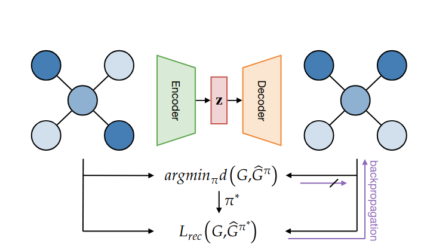

# Auto-encoding Molecules: Graph-Matching Capabilities Matter
Autoencoders are effective deep learning models that can function as generative models and learn latent representations for downstream tasks. The use of graph autoencoders--—with both encoder and decoder implemented as message passing networks--—is intriguing due to their ability to generate permutation-invariant graph representations. However, this approach faces difficulties because decoding a graph structure from a single vector is challenging, and comparing input and output graphs requires an effective permutation-invariant similarity measure, which is computationally expensive. As a result, many studies rely on approximate methods. In this work, we explore the effect of graph matching precision on the training behavior and generation capabilities of a VAE.
Our contribution is two-fold: we propose a transformer-based message passing graph decoder as an alternative to a graph neural network decoder, that is more robust and expressive by leveraging global attention mechanisms effectively. We show that the precision of graph matching has significant impact on training behavior and is essential for effective de novo (molecular) graph generation.




## Run
Tested on Ubuntu 22.1. Create a conda environment. If you want to rename it, make sure to change the variable in the ..script/run.sh file.
```console
conda env create -f environment.yml -n Graph-Matching
conda activate Graph-Matching
```
Make run.sh executable and execute in scripts. This file allows a single run. The permutation-invariant loss that is used needs to be specified. Available options are optimal Top 1, Top 10, Top 50, Top 100 matching. The optimal matching takes the best correspondence, while Top 10 randomly samples a correspondence of the best ten correspondences, etc. Further, there are a graph statistics loss and a GNN loss where the reconstruction loss is induced by an embedding space.
```console
chmod +x scripts/run.sh
./run.sh loss_type
```
Available loss_type options:
- Top1
- Top10
- Top50
- Top100
- Statistics
- GNN

If you want to run the experiments locally, then you need to reduce the batch_size. You can track your results via wandb. You need to provide your wandb key in /src/wandb_key.txt. If you dont want to use wandb, than you need to set the USE_WANDB flag to "False" in scripts/run.sh.  

Hyperparameters can be observed and adapted in src/config.json

## Results


